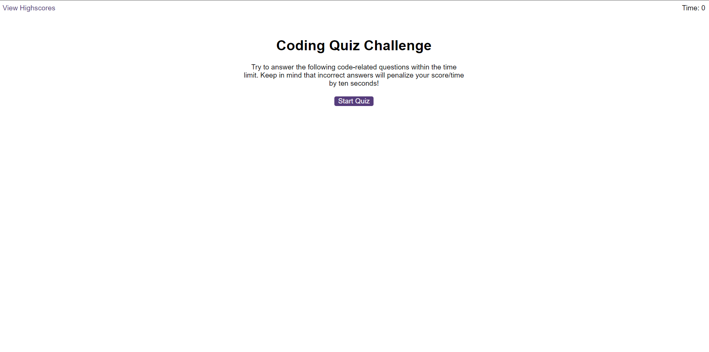
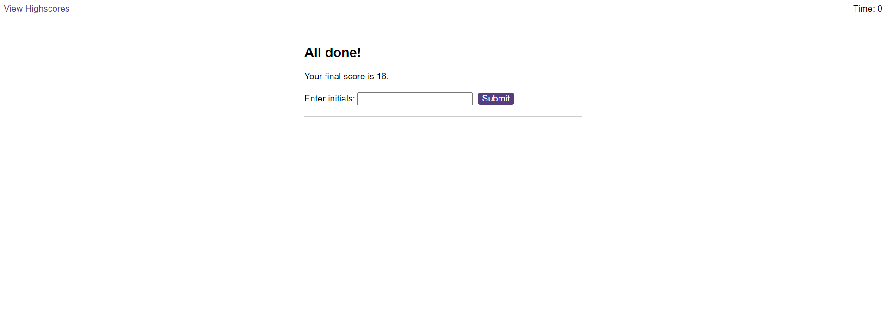

# Coding-Quiz

## Description

This repository contains a simple quiz game played in the browser. It uses a combination of HTML, simple CSS and Javascript with use of web API's. The game consists of 5 questions; answer incorrectly and time is taken off the 60 seconds you start with. The time left at the end of the game is your score. The user then has the opportunity to submit their highscore to a separate leaderboard. I made this to practice using functions and API's in Javascript. As an extra detail, the leaderboard is arranged in descending order of highscore, and a player can resubmit a new highscore if they'd like. Unfortunately I've been unable to allow players to submit multiple highscores to the leaderboard. 

## Usage
This site, unlike my previous works, has quite a few moving pieces, but is quite self explanatory. The user can start the game or view highscores from the starting scree
\\

After completing the quiz, the user can type a maximum of 3 letters for their initials to load the score into the leaderboard. Reloading the page resets the game but keeps the highscores.

Link to site: https://sidm97.github.io/Coding-Quiz/

## Credits
Credit goes to the Skills Bootcamp that taught me how to use Javascript functions and the basics of APIs. In addition, Mozilla's MDN docs and StackOverflow were both very useful in answering my questions along the way.

## License

I've used an MIT license

---